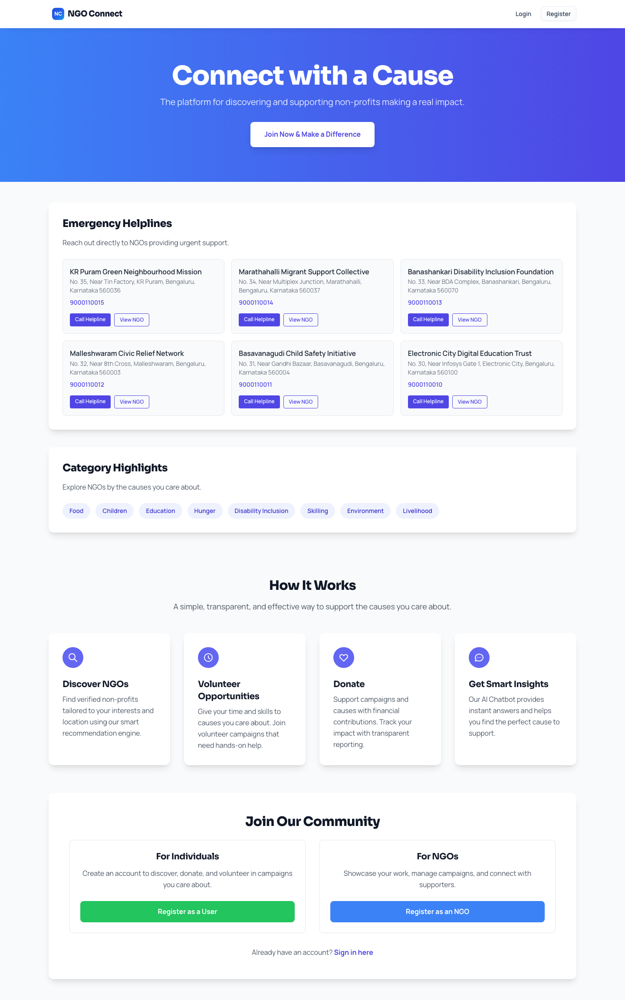
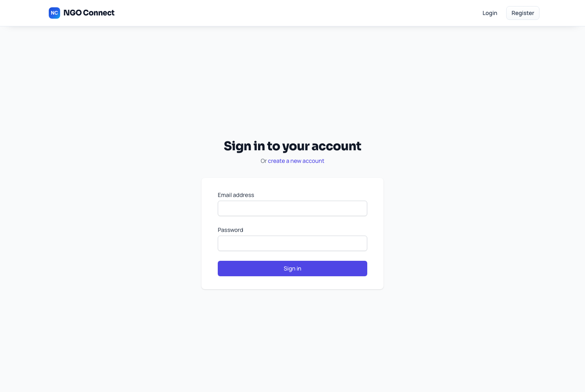
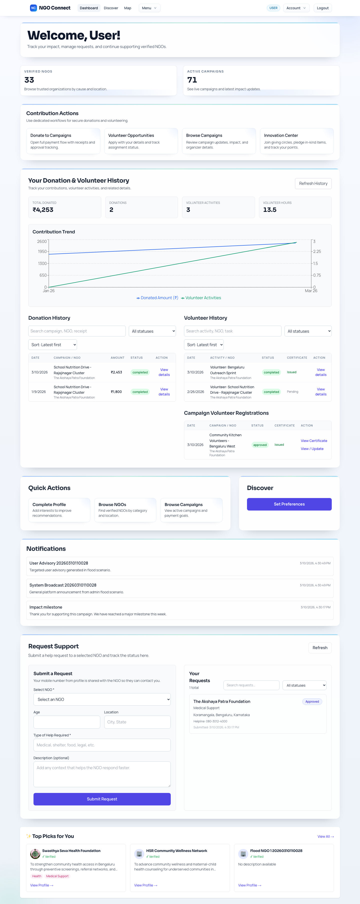
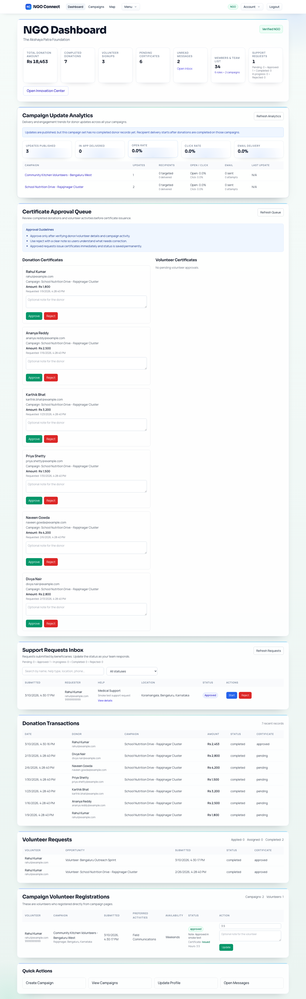
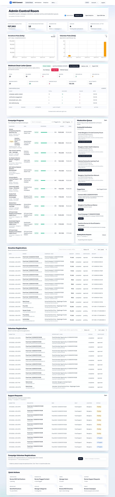
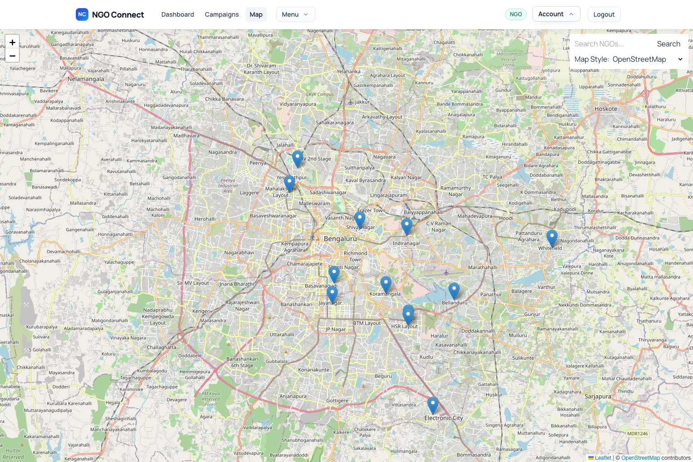

# NGO Connect

NGO Connect is a full-stack social impact platform for NGOs, donors, volunteers, and admins. It supports campaign fundraising, volunteer operations, campaign updates with delivery analytics, verification workflows, webhook reliability tooling, and innovation modules like giving circles and emergency response feeds.

This repository contains both the backend API and frontend SPA, plus data seeding/scenario scripts and generated test reports.

## Table of Contents

1. [What This Project Solves](#what-this-project-solves)
2. [Core Features](#core-features)
3. [Tech Stack](#tech-stack)
4. [Architecture Overview](#architecture-overview)
5. [Repository Structure](#repository-structure)
6. [Local Setup](#local-setup)
7. [Run the Project](#run-the-project)
8. [Default Seed Accounts](#default-seed-accounts)
9. [Environment Variables](#environment-variables)
10. [Email Delivery Metrics (Resend)](#email-delivery-metrics-resend)
11. [Important API Areas](#important-api-areas)
12. [Scripts and Utilities](#scripts-and-utilities)
13. [Troubleshooting](#troubleshooting)
14. [Task 2 Screenshots](#task-2-screenshots)
15. [Reports and Presentation Assets](#reports-and-presentation-assets)

## What This Project Solves

NGO Connect centralizes the full NGO engagement lifecycle:

- NGOs create campaigns, publish updates, and manage volunteers.
- Donors discover causes, contribute using payment gateways, and track impact.
- Volunteers find opportunities, register shifts, and receive endorsements/certificates.
- Admins moderate verifications, monitor webhook reliability, and run platform-level operations.

## Core Features

### Role-Based Platform

- JWT authentication and role guards for `user`, `ngo`, and `admin`.
- Dedicated dashboards for each role.
- Admin moderation flows for NGO verification and platform governance.

### Campaigns, Donations, and Updates

- Campaign creation and management by NGOs.
- Donation flow with provider abstraction (`mock` and Razorpay integration path).
- Campaign updates publication and recipient delivery analytics.
- Notification engagement tracking (open/click rate).

### Campaign Update Analytics

- NGO-level aggregate campaign update analytics endpoint.
- Delivery metrics across in-app and email channels.
- Legacy update normalization for analytics consistency.

### Email Delivery and Notification System

- In-app notifications for campaign updates.
- Optional email sends using SMTP or Resend.
- Delivery counters (`emailAttempted`, `emailSent`) wired into analytics.

### Webhook Reliability Operations

- Signed webhook events for update creation and engagement events.
- Persistent delivery logs and dead-letter queue support.
- Admin replay operations, runtime worker controls, metrics, and exports.
- Retention cleanup APIs and CLI.

### Innovation Center

- Giving circles with contribution progress and completion locks.
- In-kind wishlist and pledge tracking.
- Volunteer shift scheduling/logging/export.
- Donor CRM notes/segments/messaging.
- Emergency response surfacing and contribution flows.
- Corporate donation matching and gamification views.

### Data and Scenario Testing Utilities

- Flood scenario generation for stress testing.
- Role workflow scenario scripts.
- Verification interface scenario scripts.
- Fraud scoring test runner.
- Test reports auto-written to `docs/test-reports/`.

## Tech Stack

### Frontend

- React 18
- React Router v6
- Axios
- Tailwind CSS
- Recharts
- Leaflet + react-leaflet

### Backend

- Node.js + Express
- PostgreSQL (`pg`)
- JWT (`jsonwebtoken`)
- Password hashing (`bcryptjs`)
- File uploads (`multer`)
- Nodemailer (SMTP)
- Resend HTTP API integration

## Architecture Overview

```text
React SPA (frontend)
  -> Axios API client with JWT interceptor
Express API (backend)
  -> Routes, middleware, service layer
PostgreSQL
  -> Relational tables (*_rel) + indexed operational data
```

Key patterns used:

- Route-level role authorization middleware.
- Service abstraction for payments, mail delivery, and webhooks.
- Script-first operational tooling for migrations, seeding, smoke checks, and scenarios.

## Repository Structure

```text
Ngo-Connect/
|-- backend/
|   |-- sql/                      # Schema and migration SQL
|   |-- scripts/                  # Smoke/scenario/ops scripts
|   |-- src/
|   |   |-- middleware/           # Auth and role checks
|   |   |-- models/               # DB model wrappers
|   |   |-- routes/               # API route modules
|   |   |-- services/             # External provider integrations
|   |   `-- utils/                # Shared helpers (mailer, scoring, etc.)
|   |-- seed.js                   # Seed data generator
|   `-- README.md                 # Backend-focused deep documentation
|-- frontend/
|   |-- src/
|   |   |-- components/
|   |   |-- pages/
|   |   |-- services/
|   |   `-- utils/
|   `-- README.md                 # Frontend-focused deep documentation
|-- docs/
|   |-- organized/documents/      # Presentations and project docs
|   `-- test-reports/             # Generated test and scenario reports
`-- README.md
```

## Local Setup

### 1. Prerequisites

Install the following before starting:

- Node.js 18+ and npm
- PostgreSQL 14+ (or any compatible local instance)
- `psql` CLI available in your shell

### 2. Clone and Install Dependencies

```bash
git clone <your-repo-url>
cd Ngo-Connect
npm --prefix backend install
npm --prefix frontend install
```

### 3. Configure Backend Environment

```bash
cp backend/.env.example backend/.env
```

Update `backend/.env` with at least:

- `POSTGRES_URL` (or `DATABASE_URL`)
- `JWT_SECRET`
- optional mail/payment/webhook keys

### 4. Configure Frontend Environment

```bash
cp frontend/.env.example frontend/.env
```

Default `frontend/.env` API URL value (local development):

```env
REACT_APP_API_URL=http://localhost:5001/api
```

If `REACT_APP_API_URL` is not set:
- local hostnames (`localhost`, `127.0.0.1`) fall back to `http://localhost:5001/api`
- non-local deployments fall back to `/api` (you should set `REACT_APP_API_URL` explicitly for GitHub Pages or any separate frontend/backend hosting)

### 5. Create Schema and Seed Data

From repository root:

```bash
npm --prefix backend run db:relational-schema
npm --prefix backend run seed
```

Optional feature migrations (if needed for your DB state):

```bash
npm --prefix backend run db:migrate:webhooks
npm --prefix backend run db:migrate:innovation
```

## Run the Project

Open two terminals from repository root.

### Terminal 1: Backend

```bash
npm --prefix backend run dev
```

Backend default URL: `http://localhost:5001`

### Terminal 2: Frontend

```bash
npm --prefix frontend start
```

Frontend default URL: `http://localhost:3000`

## Default Seed Accounts

After `npm --prefix backend run seed`:

- Admin: `admin@ngoconnect.org` / `password123`
- User: `rahul@example.com` / `password123`
- NGO: first seeded NGO account (printed by seed script) / `password123`

## Environment Variables

See `backend/.env.example` for the complete list. Key groups:

- Core: `PORT`, `POSTGRES_URL`, `DATABASE_URL`, `JWT_SECRET`
- AI: `GEMINI_API_KEY`
- Payments: `PAYMENT_GATEWAY_PROVIDER`, `RAZORPAY_KEY_ID`, `RAZORPAY_KEY_SECRET`
- Email: SMTP (`MAIL_*`) or Resend (`RESEND_*`)
- Webhooks: `WEBHOOK_*` settings
- Auto-retry/alerting/cleanup: `WEBHOOK_AUTO_RETRY_*`, `WEBHOOK_DEAD_LETTER_*`, `WEBHOOK_CLEANUP_*`

## Email Delivery Metrics (Resend)

To make campaign update email analytics move above `0.0%`, valid outbound email delivery must succeed.

Use this in `backend/.env`:

```env
MAIL_PROVIDER=resend
RESEND_API_KEY=re_xxxxxxxxxxxxxxxxx
RESEND_FROM="NGO Connect <onboarding@resend.dev>"
RESEND_REPLY_TO=support@yourdomain.com
RESEND_TIMEOUT_MS=10000
RESEND_API_URL=https://api.resend.com
```

Then restart backend and publish a new campaign update.

Important requirements:

- `RESEND_API_KEY` must be valid (not placeholder).
- Sender/domain in `RESEND_FROM` must be allowed by your Resend account rules.
- If delivery is accepted, analytics counters like `emailSent` increase and Email Delivery % rises.

## Important API Areas

Main route groups mounted under `/api`:

- `auth`
- `users`
- `ngos`
- `campaigns`
- `donations`
- `volunteering`
- `messages`
- `notifications`
- `admin`
- `ai`
- `innovation`

Examples related to campaign updates and analytics:

- `POST /api/campaigns/:id/updates`
- `GET /api/campaigns/:id/updates/analytics`
- `GET /api/campaigns/ngo/campaign-updates/analytics`
- `POST /api/notifications/:id/open`

## Scripts and Utilities

### Backend scripts

```bash
npm --prefix backend run start
npm --prefix backend run dev
npm --prefix backend run seed
npm --prefix backend run smoke
npm --prefix backend run smoke:webhook
npm --prefix backend run smoke:webhook:worker
npm --prefix backend run webhook:worker:tick
npm --prefix backend run webhook:cleanup
npm --prefix backend run scenario:flood
npm --prefix backend run scenario:roles
npm --prefix backend run scenario:verification-interface
npm --prefix backend run scenario:detailed-ngos
npm --prefix backend run data:curate:bangalore
npm --prefix backend run test:fraud
```

### Frontend scripts

```bash
npm --prefix frontend start
npm --prefix frontend run build
npm --prefix frontend test
```

## Troubleshooting

### Campaign analytics shows 0 recipients

Cause:

- No completed donor records tied to targeted campaigns yet.

Action:

- Complete at least one donation record for campaign recipients, then publish a new update.

### Email attempts increase but sent stays 0

Cause:

- Mail provider config invalid, missing, or rejected sender/domain.

Action:

- Validate `MAIL_PROVIDER` config.
- Verify `RESEND_API_KEY` or SMTP credentials.
- Confirm sender identity in provider dashboard.

### Frontend cannot reach backend

Cause:

- API URL mismatch or backend not running.

Action:

- Confirm backend is running on `http://localhost:5001`.
- Check `frontend/.env` value for `REACT_APP_API_URL`.
- For deployed frontend (for example GitHub Pages), set `REACT_APP_API_URL` to the live backend API base (example: `https://your-backend-domain/api`).

## Task 2 Screenshots

Latest UI screenshots captured on March 10, 2026:

### Home



### Login



### User Dashboard



### NGO Dashboard



### Admin Dashboard



### Map and Navbar Verification



## Reports and Presentation Assets

- Generated validation and scenario reports: `docs/test-reports/` (runtime output, intentionally gitignored)
- Architecture presentation: `docs/organized/documents/NGO_Connect_Architecture_Presentation.pptx`
- Presentation generator script: `generate_presentation.py`

For module-specific details, refer to:

- `backend/README.md`
- `frontend/README.md`

<!-- portfolio-readme-start -->
## Project Snapshot
**Project:** Ngo-Connect
**Category:** fullstack

NGO platform with backend APIs, frontend interface, and smoke-tested workflows. Delivered a structured social-impact workflow and validated high-value journeys through smoke-tested flows.

## Tech Stack
- Node.js
- Express
- PostgreSQL
- React

## Quick Start
```bash
# Open project in your IDE and run with the project-specific command
```

## Maintainer
- Utsav Anand
- GitHub: https://github.com/utsavanand0209
<!-- portfolio-readme-end -->
